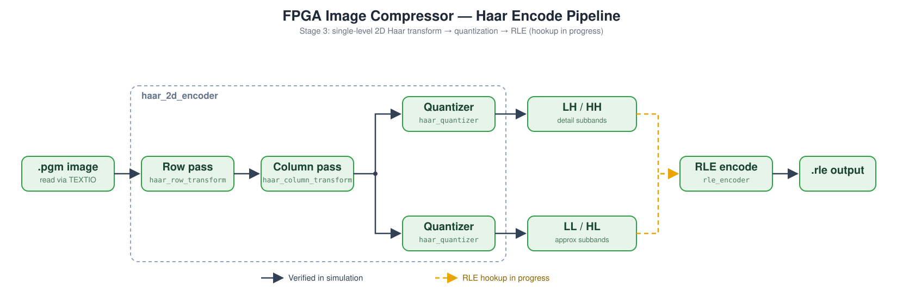

# FPGA Image Compressor
 
A from-scratch FPGA-based image compressor, written in VHDL and verified in simulation with GHDL. This is a personal project built to demonstrate hardware design skills. It is deliberately treated as an honest work-in-progress rather than a polished, finished product, with design decisions, dead ends, and trade-offs documented as they happen.
 
## Overview
 
The pipeline reads a real greyscale image, decomposes and compresses it in hardware, and (eventually) reconstructs it, with compression ratio and image quality (PSNR) measured as part of the evaluation. Two compression approaches are being built and compared:
 
- **Run-Length Encoding (RLE):** the baseline deliverable. Simple and cheap in hardware, but with no real understanding of image structure beyond adjacent-pixel repetition.
- **Haar wavelet transform (DWT) followed by RLE:** the main target. A 2D separable transform decomposes the image into approximation and detail subbands, which are quantized and then run-length encoded. The aim is to compress meaningfully better than RLE alone while staying tractable in hardware.
Everything is written and verified module-by-module in simulation before anything touches real hardware, with self-checking (assert-based) testbenches and deliberate mutation testing (breaking the design on purpose to confirm the testbench actually catches it) used as the bar for "verified."
 
## Project status
 
**Current stage: Stage 3 (Haar wavelet transform), in progress.**
 
| Stage | Goal | Status |
|---|---|---|
| 1 | Read a real image into simulation and write it back out unchanged (PGM + TEXTIO) | [x] Done |
| 2 | Run-Length Encoding, verified in simulation | [x] Done |
| 3 | Haar wavelet transform-based compressor (quantize, measure ratio/PSNR) | [ ] In progress |
| 4 | Block-based DCT compressor, for comparison (optional) | [ ] Not started |
| 5 | Run the working compressor on real FPGA hardware | [ ] Not started |
| 6 | Full write-up: diagrams, before/after images, ratio/PSNR numbers | [ ] Ongoing |
 
Within Stage 3, the following are done and verified:
 
- Single-level 2D Haar transform and per-subband quantization.
- RLE hookup: each of the four subbands has its own transpose buffer and RLE encoder, wired together in the top-level `haar_compressor`.
- End-to-end compression-ratio measurement on four real images, writing a custom `WVLT1` output file. The `.wvlt` output for one image was checked pair-for-pair against an independent Python model.
Still to do in Stage 3: multi-level recursion (recursing the transform over the LL subband), a decoder and PSNR measurement so the lossy ratio can be judged fairly, and handling of odd-sized images.
 
## Architecture
 
<picture>
  <source media="(prefers-color-scheme: dark)" srcset="architecture-dark.svg">
  <source media="(prefers-color-scheme: light)" srcset="architecture-light.svg">
  
</picture>
*(The diagram shows the RLE stage as a single box for simplicity. In the current design each subband has its own `subband_transpose_buffer` and `rle_encoder`, as shown below.)*
 
```
pixel_in -> haar_2d_encoder -+-> LL -> subband_transpose_buffer -> rle_encoder -> (count, value)
 (row pass, column pass,     +-> LH -> subband_transpose_buffer -> rle_encoder -> (count, value)
  per-subband quantizers)    +-> HL -> subband_transpose_buffer -> rle_encoder -> (count, value)
                             +-> HH -> subband_transpose_buffer -> rle_encoder -> (count, value)
```
 
Each row/column transform pass is built from a small combinational **butterfly** unit implementing the Haar lifting scheme (`d = a - b`, `s = b + floor(d/2)`), wrapped in a streaming sequential shell that feeds it a continuous pixel/coefficient stream. The two passes are chained through a small buffer inside `haar_2d_encoder`, which also owns the quantizer instances and the four independent output streams.
 
The subband streams arrive intermittently and in a different order than a raster scan, while `rle_encoder` wants a gapless stream of one row at a time. The `subband_transpose_buffer` sits between them: it collects a subband's coefficients and replays them as complete rows so RLE sees the horizontal neighbours it is designed to exploit.
 
## Repository structure
 
```
fpga-image-compressor/
├── src/                          # design sources (one entity per file)
│   ├── and_gate.vhd
│   ├── d_flip_flop.vhd
│   ├── pixel_register.vhd
│   ├── rle_encoder.vhd
│   ├── haar_butterfly.vhd
│   ├── haar_butterfly_wide.vhd
│   ├── haar_row_transform.vhd
│   ├── haar_column_transform.vhd
│   ├── haar_quantizer.vhd
│   ├── haar_2d_encoder.vhd
│   ├── subband_transpose_buffer.vhd
│   └── haar_compressor.vhd       # top level: 2D encoder + 4x (buffer + RLE)
├── sim/                          # testbenches (one <module>_tb.vhd per src module)
│   ├── haar_compressor_image_tb.vhd   # image-driven ratio measurement
│   ├── images/                   # test .pgm images (plain ASCII, P2)
│   └── output/                   # generated .rle / .wvlt files and scratch files
├── build/                        # GHDL work library (generated, gitignored)
├── run_tb.sh                     # generic per-module testbench runner
├── run_image_tb.sh               # runner for the image-driven testbench
├── rle_results.md                # Stage 2 RLE compression ratio results
├── stage3_compression_results.md # Stage 3 Haar + RLE results and findings
└── README.md
```
 
Naming convention: `src/<module>.vhd` pairs with `sim/<module>_tb.vhd`. The one exception is `haar_compressor_image_tb.vhd`, an image-driven harness with no matching module of its own.
 
## Toolchain
 
- **Language:** VHDL
- **Simulator:** [GHDL](https://ghdl.github.io/ghdl/)
- **Shell:** Git Bash / MINGW64 on Windows
- **Test image format:** PGM, plain ASCII (P2)
### Running the testbenches
 
Each module has a self-checking testbench runnable via the generic script:
 
```bash
./run_tb.sh <module_name> [stop_time]
 
# e.g.
./run_tb.sh haar_butterfly
./run_tb.sh haar_2d_encoder 2000ns
./run_tb.sh haar_compressor
```
 
This compiles the design and testbench into `build/` with GHDL, elaborates, and runs, using `--workdir=build` throughout (necessary, since running GHDL commands from inconsistent directories otherwise produces spurious "is not bound" warnings and assertion failures).
 
The image-driven testbench reads a real `.pgm` file from `sim/images/`, runs it through `haar_compressor`, and writes a `.wvlt` file to `sim/output/`. It has no matching source module, so it has its own runner, which is run from the project root:
 
```bash
./run_image_tb.sh [tb_name] [stop_time]
 
# e.g.
./run_image_tb.sh                                   # haar_compressor_image_tb, 100000ns
./run_image_tb.sh haar_compressor_image_tb 200000ns
```
 
The image name, image dimensions (`MAX_WIDTH` / `MAX_HEIGHT`) and quantization shifts are constants at the top of `haar_compressor_image_tb.vhd`. The compression ratio is reported in the simulator output when the run finishes.
 
Both runners keep their list of source files in sync by hand, so a new `src/` module needs adding to each.
 
## Module reference
 
| Module | Stage | Description |
|---|---|---|
| `pixel_register` | 1 | Single-cycle 8-bit pixel register, used as a placeholder stage in the image I/O pipeline. |
| `image_io_tb` | 1-2 | Testbench harness: reads a `.pgm` file via TEXTIO, streams pixels through the module under test, and writes a result file. Wired to `rle_encoder`, producing a custom `RLE1`-tagged `.rle` text format and reporting compression ratio in bits. |
| `rle_encoder` | 2-3 | Runtime-configurable run-length encoder. `MAX_WIDTH` (generic) sets the maximum row capacity; `row_width` (runtime port) sets the actual row length in use; `COUNT_BITS` (generic) sizes the run-length field; `DATA_WIDTH` (generic) sets the width of the signed value field (8 for raw pixels, 10 for wavelet coefficients). Takes a gapless input stream qualified by `valid_in` and flushes `(count, value)` pairs on a value change, a run-length overflow, or end-of-row. |
| `haar_butterfly` | 3 | Combinational Haar lifting-scheme core. Takes two 8-bit unsigned pixels, outputs a 9-bit signed difference `d` and an 8-bit unsigned sum `s = b + floor(d/2)` (floor via arithmetic right shift on two's complement). |
| `haar_row_transform` | 3 | Streaming sequential wrapper: pairs adjacent pixels in a row through `haar_butterfly` as they arrive. Has an `enable` input to hold the module's internal phase until its consumer is ready. |
| `haar_butterfly_wide` | 3 | Butterfly variant for the column pass. Takes two already-9-bit-signed coefficients (row-pass outputs), producing a 10-bit signed `d` and 9-bit signed `s`. |
| `haar_column_transform` | 3 | Streaming sequential wrapper mirroring `haar_row_transform`, applying `haar_butterfly_wide` down a column of row-pass coefficients. |
| `haar_quantizer` | 3 | Combinational quantizer: arithmetic right shift of a signed coefficient by a runtime `shift` amount (a runtime port rather than a generic, so quantization level can be swept per data point without re-synthesizing). |
| `haar_2d_encoder` | 3 | Orchestrator for the transform. A 2-state FSM (`ROW_PASS` / `COLUMN_PASS`) runs the row pass then the column pass across a full image, buffers intermediate coefficients, quantizes the results, and emits four independent, individually-valid subband streams: `ll_out`, `lh_out`, `hl_out`, `hh_out` (10-bit signed each). |
| `subband_transpose_buffer` | 3 | Collects one subband's intermittent coefficient stream and replays it as complete, gapless rows for the RLE encoder. One instance per subband. |
| `haar_compressor` | 3 | Top level. Wires `haar_2d_encoder` to four `subband_transpose_buffer` + `rle_encoder` pipelines and exposes a `(count, value, valid)` output per subband, plus a runtime shift input per subband. Sized by `MAX_WIDTH` / `MAX_HEIGHT` generics and `row_width` / `column_height` runtime ports. |
| `haar_compressor_image_tb` | 3 | Image-driven harness: reads a `.pgm`, runs it through `haar_compressor`, collects each subband's pairs with its own process, assembles a `WVLT1`-tagged `.wvlt` file in fixed subband order (LH, LL, HL, HH), and reports the compression ratio. Simulation only (uses TEXTIO). |
 
Every module has a matching `_tb.vhd` testbench with self-checking asserts, validated by deliberately reintroducing bad data and confirming the testbench flags it.
 
## Results so far
 
### RLE (Stage 2)
 
Compression ratio is measured in bits, not text-file bytes: original size is `width x height x 8` bits (one byte per pixel); compressed size is `pairs x (COUNT_BITS + 8)` bits, where `COUNT_BITS = 5` in these tests.
 
| Image | Dimensions | Pairs produced | Compression ratio | Notes |
|---|---|---|---|---|
| `plus_16x16` | 16x16 | 40 | **3.94 : 1** | Large uniform regions (background + cross shape) compress well. |
| `gradient_8x8` | 8x8 | 64 | **0.615 : 1** | Worst case: every pixel differs from its horizontal neighbour, so every pixel becomes its own run. 62.5% *larger* than the original. |
| `checkerboard_8x8` | 8x8 | 64 | **0.615 : 1** | Same worst-case mechanism as the gradient, despite looking completely different to a human eye. |
 
**Key finding:** RLE's compression ratio depends entirely on horizontal adjacent-pixel repetition. It has no concept of visual structure beyond that. The gradient and checkerboard images are visually unrelated but functionally identical to this encoder, both hitting the exact same worst case.
 
### Haar wavelet transform + RLE (Stage 3)
 
Compressed size is `pairs x (DATA_WIDTH + COUNT_BITS)` = `pairs x 15` bits (10-bit signed value, 5-bit count), summed over all four subbands. The file header is not counted. Quantization shifts for these runs: LH = 3, LL = 2, HL = 4, HH = 3. Full methodology and findings are in [`stage3_compression_results.md`](stage3_compression_results.md).
 
| Image | Dimensions | Pairs | Haar + RLE ratio | Plain RLE (Stage 2) |
|---|---|---|---|---|
| `gradient_8x8` | 8x8 | 37 | **0.9225 : 1** | 0.6154 : 1 |
| `checkerboard_8x8` | 8x8 | 16 | **2.1333 : 1** | 0.6154 : 1 |
| `plus_16x16` | 16x16 | 44 | **3.1030 : 1** | 3.9385 : 1 |
| `vignette_16x16` | 16x16 | 117 | **1.1670 : 1** | ~1.2212 : 1 (modelled) |
 
**What this shows:**
 
- The transform rescues the two images that were RLE's exact worst case. A smooth ramp or a regular pattern becomes a handful of small or constant coefficients, which RLE handles well.
- It does not help where plain RLE is already strong. On `plus_16x16` and `vignette_16x16` the transform scatters edges across several coefficients and each pair is wider (15 bits against 13), so Haar + RLE comes out behind.
- **There is a hard ceiling from per-row flushing.** `rle_encoder` flushes at the end of every row, so each subband row costs at least one pair. A W x H image has four subbands of H/2 rows, giving at least `2H` pairs and a maximum ratio of `4W/15`. `checkerboard_8x8` sits exactly on that ceiling (2.1333).
- **This is not yet a fair comparison.** Plain RLE is lossless while Haar + RLE is lossy, so part of the ratio is bought with image quality. PSNR measurement is needed to say how much.
`vignette_16x16` was designed for this stage: concentric square rings fading from 255 at the centre to 31 at the border, so the middle rows have no repeated adjacent pixels while the outer rows are mostly flat. Its full `.wvlt` output was checked pair-for-pair against an independent Python model of the pipeline (Haar lifting, arithmetic-shift quantizer, per-row RLE), and all four subbands matched exactly.
 
## Known gaps / next steps
 
- **Multi-level recursion not yet implemented.** `enable` on the row/column transforms is currently a *pause*, not a *reset*, which is fine for a single pass from power-on but not for feeding a sub-image back through a second time. The options (make `enable` a reset-and-enable, add a separate reset, or chain a second `haar_2d_encoder`) need a decision before the recursion wrapper can be written.
- **No decoder and no PSNR yet.** The `.wvlt` file can be produced but not reconstructed, so image quality is unmeasured and only one image's output has been independently checked (against a Python model). A decoder (in hardware or as a script) is the next piece needed to sweep the shifts and plot ratio against PSNR.
- **Only one set of quantization shifts has been run**, and the ratio is sensitive to them.
- **Fixed 15-bit pair width is conservative.** The quantized values and run lengths in the tests need fewer bits, so tighter field widths or a real entropy coder would improve every ratio. Left as a stated assumption.
- **Odd-sized rows/columns aren't handled yet.** Both transform passes currently assume even width and height.
- **No real hardware yet.** Everything so far is simulation-only (GHDL). The RTL itself is written to be synthesizable; only the testbench uses TEXTIO and scratch files. Stage 5 targets running a stored test image through real FPGA hardware, with a UART transmitter planned as the output path in place of file I/O.
